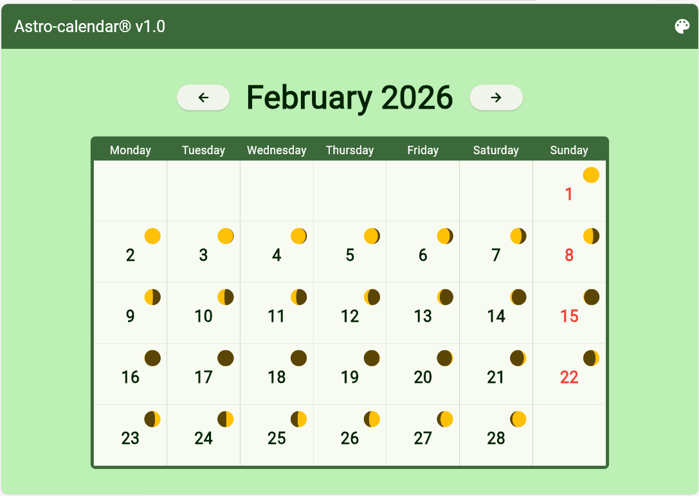
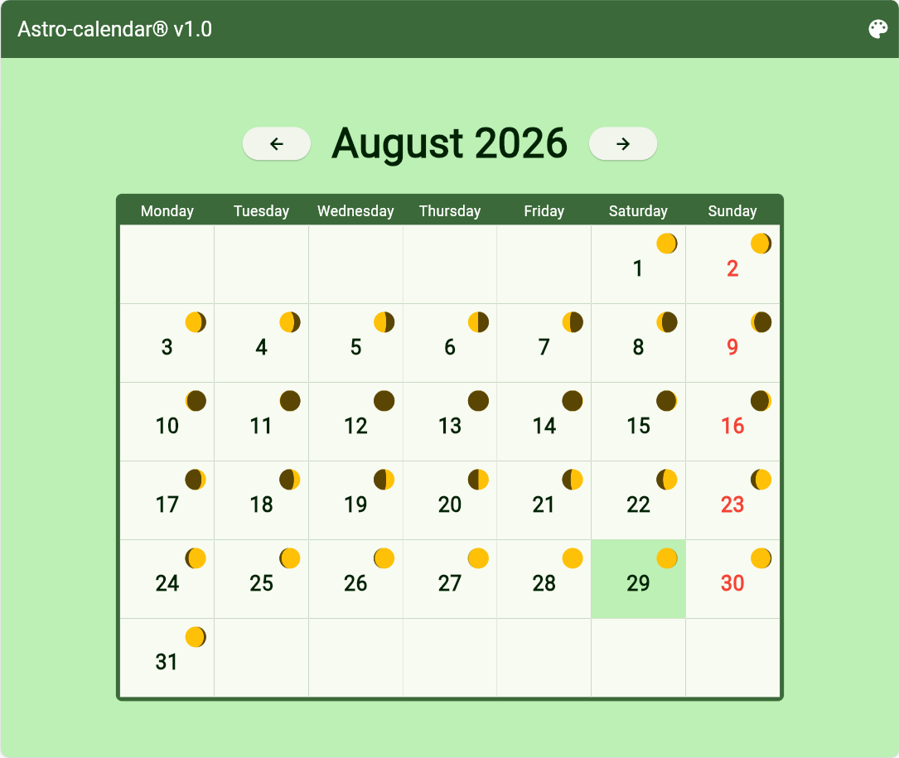
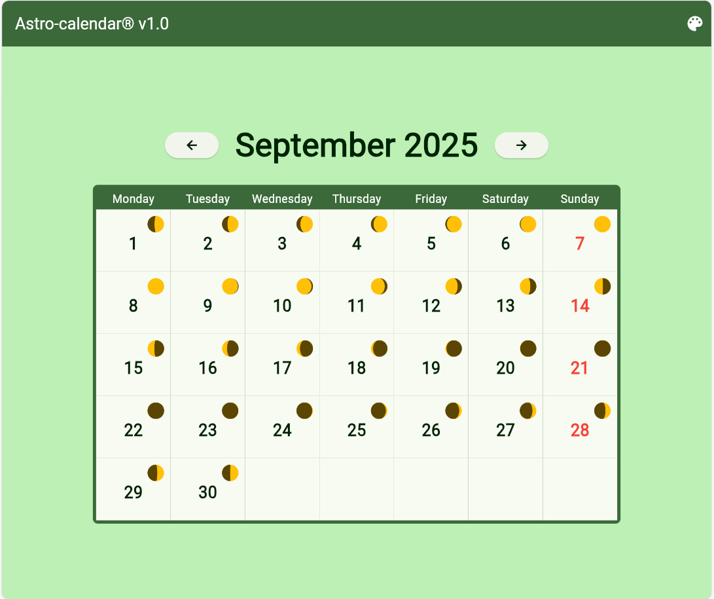
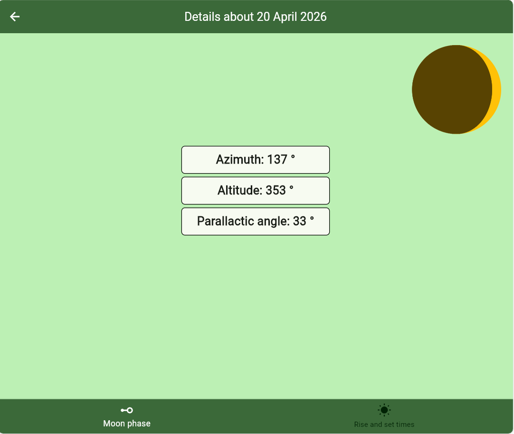
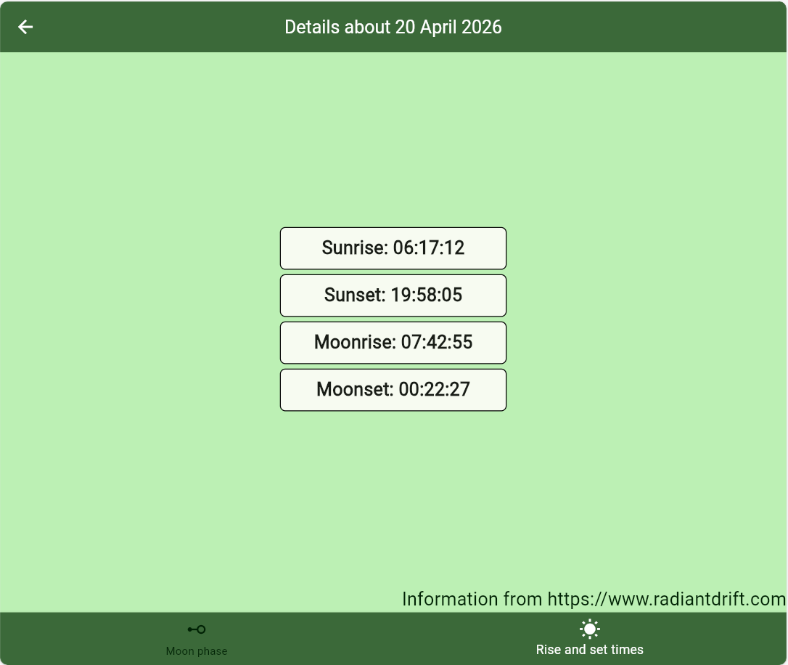
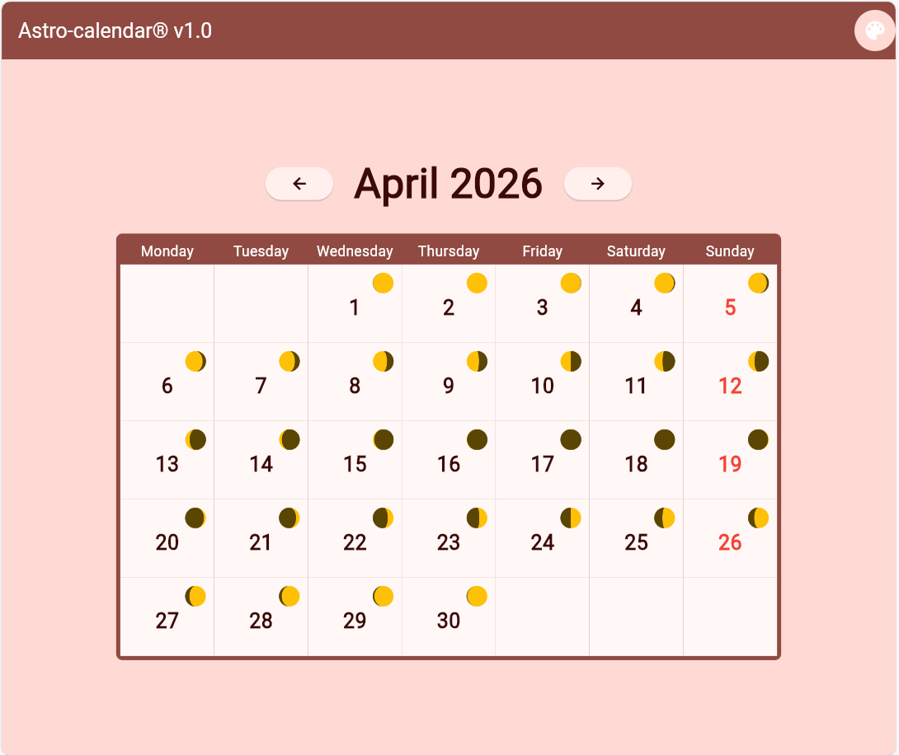

- # Nome: Chiara Lucia Melle, numero di matricola: 344940

- # Titolo del progetto: Astro-calendar

- # Idea e feature principali: 

L'obiettivo del progetto è mettere a disposizione un calendario che dia informazioni astronomiche su luna e sole. Il calendario parte dal mese e anno attuale e permette di navigare avanti o indietro nel tempo, visualizzando di volta in volta un diverso mese. Per il mese che si sta visualizzando è possibile consultare il giorno della settimana associato ad ogni data di quel mese. Le domeniche sono contrassegnate in rosso. Per ogni data viene mostrata la fase lunare attuale tramite un'immagine della luna. In questo modo si può vedere a colpo d'occhio lo sviluppo della fase lunare nel mese che si sta visualizzando. Se si vogliono avere informazioni più dettagliate su un certo giorno, basta cliccare su di esso. Questo permette di consultare informazioni più dettagliate sulla posizione lunare e solare di quel giorno. Si può anche cambiare il tema dell'app passando ad un nuovo colore scelto casualmente.

- # User experience:

1. Avviando l'applicazione viene visualizzata la homepage, che mostra il mese corrente:

2. Nell'homepage è possibile navigare in avanti o indietro nel tempo a piacimento a partire dal mese corrente:

3. Nel mese che si sta visualizzando è presente un overview/vista sulla fase lunare di ogni giorno di quel mese. Cliccando su uno specifico giorno si viene diretti ad una pagina in cui vengono date informazioni più dettagliate sulle caratteristiche di luna e sole in quella data. Di default viene mostrato il contenuto su azimuth, altitudine e angolo parallattico della luna:

4. Da qui si può navigare alla pagina "rise and set times" che contiene gli orari di alba e tramonto di luna e sole per quella specifica data.

5. Da qui è sempre possibile tornare indietro nella homepage usando la freccia in alto a sinistra nella barra dell'applicazione.
Dalla homepage è inoltre possibile cambiare il colore/tema dell'applicazione dall'homepage cliccando sull'icona nella parte destra della barra dell'applicazione:

- # Dipendenze:

I pacchetti usati sono i seguenti:
- riverpod e flutter_riverpod per la gestione dello stato tramite provider
- moonphase per mostrare l'immagine della luna nella sua fase di una certa data
- apsl_sun_calc per avere azimuth, altitudine e angolo parallattico della luna
- http per fare richieste HTTP con metodo get all'api https://www.radiantdrift.com
- intl per la formattazione della data
- localstorage per salvare in modo persistente gli orari di alba e tramonto ottenuti interagendo con l'api

- # Scelte di implementazione:
- Il calendario e le sue funzionalità basiche (vista sul mese, ordinamento delle date a seconda del giorno della settimana associato, navigazione in avanti e indietro nel tempo, domeniche contrassegnate) è stato implementato senza usare un pacchetto apposito.
- L'applicazione comunica con l'api https://www.radiantdrift.com  per ottenere gli orari di alba e tramonto di sole e luna per la data richiesta dall'utente
- Per migliorare le prestazione, una volta ottenuti gli orari dalla richiesta HTTP, questi vengono trasformati in stringhe e salvati in localStorage. In questo modo se l'utente chiede altre volte gli orari di alba e tramonto della stessa data, questi vengono presi dalla memoria senza dover rieffetturare la richiesta al server di radiantdrift.
